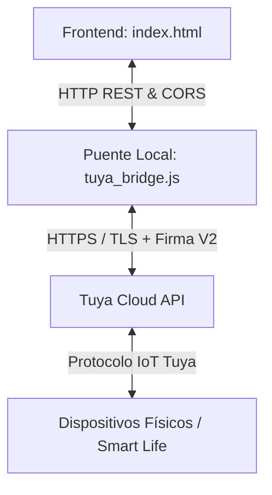

# SmartHome HMI - Domótica & Control Residencial

Una interfaz interactiva de monitoreo y control para hogares inteligentes, integrada con la nube de **Tuya Cloud / Smart Life**. Este proyecto proporciona un panel HMI (Human-Machine Interface) intuitivo con un plano de planta interactivo en SVG, visualizaciones de datos históricos en tiempo real y un puente de comunicación (Bridge Server) que interactúa directamente con las APIs de desarrollo de Tuya.

---

## 🏗️ Arquitectura del Sistema

El sistema sigue una arquitectura desacoplada de 3 capas:



1. **Frontend (`index.html`)**: Interfaz web de usuario construida con HTML5, CSS3 vanilla (con diseño adaptativo, animaciones fluidas y HSL) y JavaScript puro. Muestra un plano mímico en SVG con zonas activas (hotspots) y paneles laterales con el listado de dispositivos y gráficos dinámicos de historial de comportamiento.
2. **Servidor Puente (`tuya_bridge.js`)**: Servidor local Node.js (puerto `3000`) que actúa como intermediario seguro (Proxy). Administra las credenciales del desarrollador de Tuya, genera las firmas de seguridad criptográficas para las solicitudes HTTPS, almacena en caché el Token de Acceso y mapea las peticiones simples de la interfaz a los comandos DP de Tuya.
3. **Tuya Cloud Platform**: Backend en la nube de Tuya que recibe los comandos firmados del puente, consulta el estado de los dispositivos vinculados a la app Smart Life y envía las señales de control a los actuadores físicos.

---

## ✨ Características Clave

- **Plano Mímico SVG Dinámico**: Representación gráfica de la vivienda (Habitación Principal, Baño Principal, Habitación 2, Oficina, Pasillo, Cafetería/Lavadero, Sala Principal y Patio). Las habitaciones brillan suavemente con colores correspondientes a su estado actual (amarillo para luces encendidas, azul para aire acondicionado encendido).
- **Control Omnidireccional en Tiempo Real**:
  - **Iluminación**: Encendido y apagado de luces en cada área.
  - **Climatización**: Encendido/apagado del Aire Acondicionado y ajuste de consigna de temperatura (16°C - 30°C).
  - **Seguridad**: Bloqueo y desbloqueo de la cerradura principal con actualización visual de estados (rojo bloqueada / verde desbloqueada).
  - **Multimedia**: Control de encendido/apagado de la Smart TV.
- **Visualización de Historial**: Cada dispositivo cuenta con un gráfico SVG dinámico en su modal de detalles que traza el historial de los últimos 20 estados registrados (temperatura del sensor, encendido/apagado, estado de cerradura).
- **Doble Modo de Operación**:
  - **Modo Simulación (Mock Mode)**: El sistema corre de forma autónoma simulando variaciones térmicas aleatorias (convergencia a temperatura objetivo cuando el AC está prendido y deriva ambiental cuando está apagado) y permitiendo probar la interfaz completa sin credenciales de la API.
  - **Modo Real (Live Mode)**: Realiza consultas HTTP al puente Node.js cada 5 segundos para mantener sincronizados los dispositivos físicos en tiempo real.
- **CORS Habilitado**: Configuración abierta en el puente para recibir las conexiones directas del frontend ejecutándose localmente.

---

## 🔐 Algoritmo de Firma Tuya API V2 (Core Criptográfico)

La comunicación directa con las APIs oficiales de Tuya requiere la firma criptográfica de cada petición HTTPS para evitar ataques de intermediarios (Replay Attacks). El archivo [tuya_bridge.js](file:///C:/Users/USUARIO/.gemini/antigravity-ide/scratch/SmartHome_HMI/tuya_bridge.js) implementa el algoritmo estándar de Tuya:

1. **Hash de Cuerpo de Petición (Content-SHA256)**: Se genera un hash SHA256 del cuerpo JSON del mensaje (si no hay cuerpo, se genera del string vacío).
2. **String to Sign**: Se concatenan las siguientes cadenas separadas por saltos de línea (`\n`):
   `Método HTTP + "\n" + Content-SHA256 + "\n" + Headers Personalizados + "\n" + URL Path`
3. **Sign String**: Se concatena la información de autenticación:
   `ClientID + AccessToken (si aplica) + Timestamp (ms) + Nonce (vacío por defecto) + StringToSign`
4. **Firma Final**: Se aplica una firma digital utilizando el algoritmo **HMAC-SHA256** con la clave secreta `ClientSecret` del desarrollador de Tuya, y el resultado se convierte a mayúsculas.

```javascript
const contentSha = crypto.createHash('sha256').update(body).digest('hex');
const stringToSign = `${method}\n${contentSha}\n${headersStr}\n${pathUrl}`;
const signStr = config.clientId + accessToken + t + nonce + stringToSign;
const signature = crypto.createHmac('sha256', config.clientSecret)
                        .update(signStr)
                        .digest('hex')
                        .toUpperCase();
```

---

## 🎛️ Mapeo de Data Points (DPs)

Los dispositivos vinculados a Tuya se comunican por medio de códigos DPs de estado y comandos. El servidor puente traduce los comandos simples del HMI a los DPs de Tuya según el modelo:

| Tipo de Dispositivo | ID de Dispositivo Simulado | Código DP Tuya | Tipo de Valor | Mapeo del Estado |
| :--- | :--- | :--- | :--- | :--- |
| **Iluminación** (1 Gang) | Varios (ej. `ebfc...v21v`) | `switch_1` o `switch` | Boolean | `true` (ON) / `false` (OFF) |
| **Iluminación** (Multi-Gang) | `eb6d23ecf9be9e3fd1aydl` | `switch_1`, `switch_2` | Boolean | Se controlan todos los gangs en paralelo |
| **Cerradura** | `eb7cf6af22271b7086dama` | `closed` | Boolean | `true` (Cerrado/Bloqueado) / `false` (Abierto) |
| **Aire Acondicionado** (OnOff) | `eb81eb213ea6311bc5f4x9` | `switch` | Boolean | `true` (ON) / `false` (OFF) |
| **Aire Acondicionado** (Temp) | `eb81eb213ea6311bc5f4x9` | `temp_set` | Integer | Temperatura de consigna de aire acondicionado |
| **Sensor de Temperatura** | `eb8a029eac3849c00ao5lr` | `va_temperature` | Float | Temperatura ambiente leída en tiempo real |
| **Sensor de Humedad** | `eb8a029eac3849c00ao5lr` | `va_humidity` | Integer | Humedad relativa del aire |

---

## 🔌 API Endpoints del Servidor Puente

El servidor local expone los siguientes endpoints HTTP REST en el puerto `3000`:

### `GET /api/status`
Verifica si el servidor puente está en línea y configurado con credenciales.
- **Respuesta exitosa (200 OK)**:
  ```json
  {
      "status": "online",
      "mode": "mock",
      "hasCredentials": false
  }
  ```

### `POST /api/config`
Configura las credenciales de conexión con Tuya Cloud. Guarda las credenciales dinámicamente en el archivo local `tuya_config.json`.
- **Cuerpo JSON**:
  ```json
  {
      "mode": "live",
      "clientId": "tu_client_id",
      "clientSecret": "tu_client_secret",
      "endpoint": "https://openapi.tuyaus.com",
      "schema": "smartlife"
  }
  ```
- **Respuesta exitosa (200 OK)**:
  ```json
  { "success": true, "mode": "live" }
  ```

### `GET /api/devices`
Obtiene los estados actuales de todos los dispositivos del hogar. En modo `live`, ejecuta peticiones paralelas a la API REST de Tuya para recopilar estados actualizados.
- **Respuesta exitosa (200 OK)**:
  ```json
  [
      { "id": "ebfc0dbec9868bd91fn21v", "status": { "on": false } },
      { "id": "eb8a029eac3849c00ao5lr", "status": { "temp": 21.8, "hum": 52 } }
  ]
  ```

### `POST /api/device/:id/command`
Envía un comando de acción de control a un dispositivo específico.
- **Cuerpo JSON**:
  ```json
  { "command": "on", "value": true }
  ```
- **Respuesta exitosa (200 OK)**:
  ```json
  { "success": true, "tuyaResult": { ... } }
  ```

---

## 🚀 Instalación y Puesta en Marcha

Sigue estos pasos para ejecutar la interfaz SmartHome HMI localmente en tu red:

### Requisitos Previos
- **Node.js** v14 o superior instalado en la máquina donde correrá el puente.

### 1. Iniciar el Servidor Puente
Abre la consola en el directorio del proyecto y arranca el puente Node.js:
```bash
node tuya_bridge.js
```
Verás la confirmación de inicialización en la consola:
```text
==================================================================
  Tuya Smart Life HMI Proxy Bridge funcionando en puerto 3000
  Modo actual: MOCK
  Visualiza el HMI abriendo el archivo index.html en tu navegador.
==================================================================
```

### 2. Abrir la Interfaz de Usuario
Simplemente haz doble clic sobre el archivo [index.html](file:///C:/Users/USUARIO/.gemini/antigravity-ide/scratch/SmartHome_HMI/index.html) para abrirlo en cualquier navegador web moderno. 

### 3. Vincular con tu Cuenta de Desarrollador de Tuya (Opcional)
Para controlar dispositivos reales:
1. Ve a la plataforma de desarrollo de Tuya en [iot.tuya.com](https://iot.tuya.com) y crea un proyecto en la nube.
2. Vincula tus dispositivos de la aplicación **Smart Life / Tuya Smart** al proyecto en la sección "Link Tuya App Account".
3. Copia el **Access ID (Client ID)** y el **Access Secret (Client Secret)** del proyecto.
4. En la interfaz HMI web, haz clic en **Tuya API Config** (esquina superior derecha).
5. Cambia el modo a **Servidor Puente Real (Live Tuya API)**, ingresa tus credenciales y selecciona el endpoint regional correcto.
6. Haz clic en **Guardar Configuración**. El puente comenzará a sincronizar tus dispositivos en tiempo real de forma automática.
