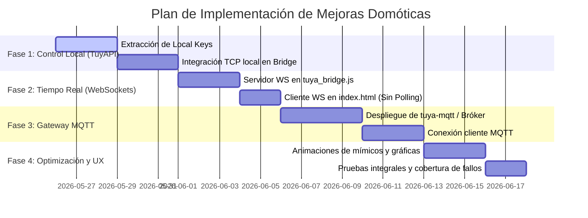

# Roadmap Técnico - SmartHome HMI

Este documento describe el plan de trabajo y los hitos clave para la evolución tecnológica de la interfaz HMI y el servidor puente de Smart Home. Los dos pilares principales son la migración hacia **control local de dispositivos (TuyAPI)** para eliminar la latencia de la nube y la implementación de **conexión bidireccional en tiempo real (WebSockets / MQTT)** para sustituir el polling periódico.

---

## 📌 Hitos del Plan de Trabajo

El desarrollo se estructurará en **cuatro fases lógicas**:

---

### 📡 Fase 1: Migración a Control Local (TuyAPI)
*Objetivo: Controlar los dispositivos dentro de la red local, eliminando la dependencia de la API en la nube de Tuya, reduciendo la latencia de 2 segundos a menos de 100 milisegundos.*

- [ ] **Hito 1.1: Extracción de credenciales locales (`Local Keys`)**
  - Configurar las herramientas de extracción de Tuya (como `tuya-cli wizard` o volcando datos del portal Tuya Developer).
  - Recopilar el par `Device ID` y `Local Key` para cada uno de los dispositivos IoT vinculados.
  - Diseñar el esquema del nuevo archivo local `tuya_keys.json` para almacenar las credenciales de forma segura y estructurada.
- [ ] **Hito 1.2: Implementación de TuyAPI en el servidor puente**
  - Instalar la dependencia `@codetheweb/tuyapi` en el proyecto Node.js (`npm install @codetheweb/tuyapi`).
  - Reemplazar la lógica de solicitud HTTP Cloud (`makeTuyaRequest`) en `tuya_bridge.js` por sockets de conexión directa TCP.
  - Asegurar la reconexión automática en el puente en caso de desconexión del socket del dispositivo.
- [ ] **Hito 1.3: Gestión de estados offline y concurrencia**
  - Implementar lógica para liberar los sockets TCP cuando no se usen (puesto que los dispositivos Tuya solo permiten una conexión TCP local activa simultáneamente).
  - Diseñar un mecanismo de fallback automático: si la conexión local falla, intentar recuperar el estado a través de la nube de Tuya o la base de datos local simulada.

---

### 🔄 Fase 2: Conexión Bidireccional con WebSockets (Event-Driven)
*Objetivo: Reemplazar las consultas HTTP repetitivas (polling de 5 segundos) por una comunicación persistente basada en eventos para refrescar la interfaz instantáneamente.*

- [ ] **Hito 2.1: Servidor WebSocket en `tuya_bridge.js`**
  - Integrar la biblioteca `ws` de Node.js (`npm install ws`) en el servidor puente.
  - Configurar el servidor WebSocket para escuchar en el mismo puerto que el servidor HTTP (`3000`) o en un puerto dedicado (`3001`).
  - Diseñar el formato de los mensajes JSON para eventos de actualización de estados (`device_status_update`) y comandos de control (`device_command`).
- [ ] **Hito 2.2: Cliente WebSocket en el Frontend (`index.html`)**
  - Eliminar el temporizador de consulta periódica `queryLiveTuyaApi` (línea 1063 de `index.html`).
  - Implementar la conexión de cliente WebSocket nativa del navegador: `new WebSocket("ws://localhost:3000")`.
  - Crear manejadores de eventos para reconectar automáticamente con lógica de retraso exponencial (Exponential Backoff) si se cae el servidor del puente.
- [ ] **Hito 2.3: Sincronización instantánea de eventos**
  - Al recibir una actualización del socket de TuyAPI local, propagar el cambio inmediatamente a todos los clientes WebSockets conectados.
  - Permitir que el estado de los interruptores físicos se actualice en la pantalla del mímico casi al instante de haber sido presionados manualmente en la pared.

---

### 🔀 Fase 3: Puerta de Enlace Estándar con MQTT (Opcional/Avanzado)
*Objetivo: Integrar el ecosistema con brókers de mensajería estándar para compatibilidad con otros controladores como Node-RED o Home Assistant.*

- [ ] **Hito 3.1: Configuración del Bróker MQTT**
  - Desplegar una instancia local de **Eclipse Mosquitto** mediante Docker u otro método alternativo.
  - Configurar la seguridad (usuario y contraseña) y habilitar el transporte a través de WebSockets en el puerto `9001`.
- [ ] **Hito 3.2: Implementación de `tuya-mqtt`**
  - Configurar la herramienta de código abierto `tuya-mqtt` para enlazar los dispositivos locales con el bróker.
  - Publicar los estados de los dispositivos en temas estructurados como: `tuya/dispositivo_id/state`.
  - Escuchar comandos de control en temas como: `tuya/dispositivo_id/command`.
- [ ] **Hito 3.3: Adaptación del Frontend**
  - Agregar la librería JavaScript `Paho MQTT` o `mqtt.js` en el navegador.
  - Conectar el dashboard al bróker y suscribir las vistas del plano interactivo directamente a los temas correspondientes.

---

### 🎨 Fase 4: Optimización Visual de Interfaz y Gráficos (UX/UI)
*Objetivo: Dotar a la interfaz de animaciones fluidas y visualizaciones profesionales que reflejen las actualizaciones instantáneas de estado.*

- [ ] **Hito 4.1: Transiciones fluidas en el Mímico SVG**
  - Implementar transiciones de CSS en la propiedad `fill` y `filter` de los polígonos y hotspots del plano.
  - Añadir efectos de fundido suaves (Glow transitions) al encender y apagar las luces y el aire acondicionado.
- [ ] **Hito 4.2: Gráficas dinámicas de series temporales**
  - Crear transiciones fluidas en el trazado de los vectores SVG (`d` attribute of paths) en el historial del modal.
  - Incorporar animaciones que desplacen los puntos del gráfico hacia la izquierda cuando entre un dato nuevo.
- [ ] **Hito 4.3: Alertas visuales de pérdida de señal**
  - Si un dispositivo pierde la conexión de red (offline), oscurecer su hotspot en el plano y mostrar una insignia de advertencia en el sidebar lateral.

---

## 🛠️ Tecnologías a Incorporar
- **Capa Local**: `@codetheweb/tuyapi` (Node.js) para sockets TCP directos.
- **Canal de Tiempo Real**: `ws` (Node.js) para comunicación basada en WebSockets o `mqtt` si se opta por bróker.
- **Librería del Navegador**: WebSocket nativo de HTML5 o `paho-mqtt` JS.
- **Gráficos**: Manipulación dinámica de SVG Paths mediante JS y CSS transitions.
